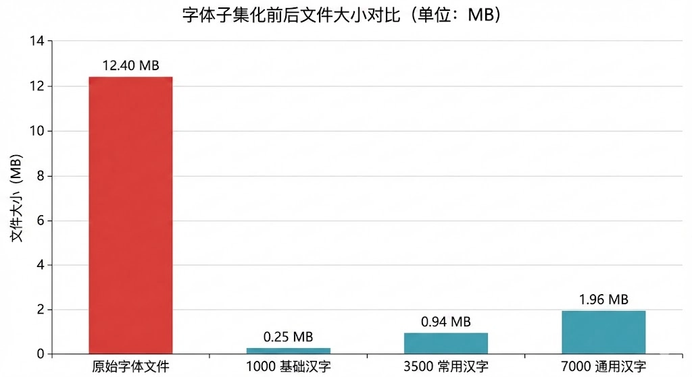

# LiteHan ✨

LiteHan 是一个收集常用 **1000、3500、7000 汉字** 以及常用符号的仓库，旨在帮助开发者快速生成 **精简化字体文件**，减少字体体积，提升应用性能。

## 🏷️ 项目徽章


## 📂 仓库内容

- **1000 常用汉字**
- **3500 常用汉字**
- **7000 通用汉字**
- **常用符号集**

这些文件可用于生成轻量化的字体文件，适合前端项目、移动应用或嵌入式设备。

## 📑 Han 文件格式

文件采用简洁的行式结构：

```
符号
汉字
```

每一行包含一系列符号或汉字，方便解析与处理。

## 🔗 下载地址

- [3500 常用汉字 & 7000 通用汉字](https://faculty.blcu.edu.cn/xinghb/zh_CN/article/167473/content/1045.htm)

## 🎯 使用场景

- 前端项目中减少字体包大小
- 移动应用优化加载速度
- 嵌入式设备节省存储空间
- 字体子集化处理

## 🚀 快速开始

1. 克隆仓库：
   ```bash
   git clone https://github.com/cheungxiongwei/LiteHan.git
   ```
2. 根据需求选择对应的汉字文件
3. 使用字体子集化工具（如 `fonttools`、`pyftsubset`）生成精简字体

```py
pyftsubset input.ttf --text-file=3500.han --output-file=subset3500.ttf
pyftsubset input.ttf --text-file=3500.han --flavor=woff2 --output-file=subset.woff2
```

## 📊 效果展示
| 集合类型 | 汉字数量 | 文件大小 | 用途定位 |
|----------|----------|----------|----------|
| 原始字体 | 全量汉字 | 12.40 MB | 未优化，体积庞大 |
| 1000 基础常用 | 1000 | 0.25 MB | 极简场景，UI/嵌入式 |
| 3500 常用 | 3500 | 0.94 MB | 日常交流、教育、通用应用 |
| 7000 通用 | 7000 | 1.96 MB | 学术、专业文献、广覆盖 |



## ❤️ 致谢

本仓库数据来源于北京语言大学相关资源，感谢学术界的支持。
